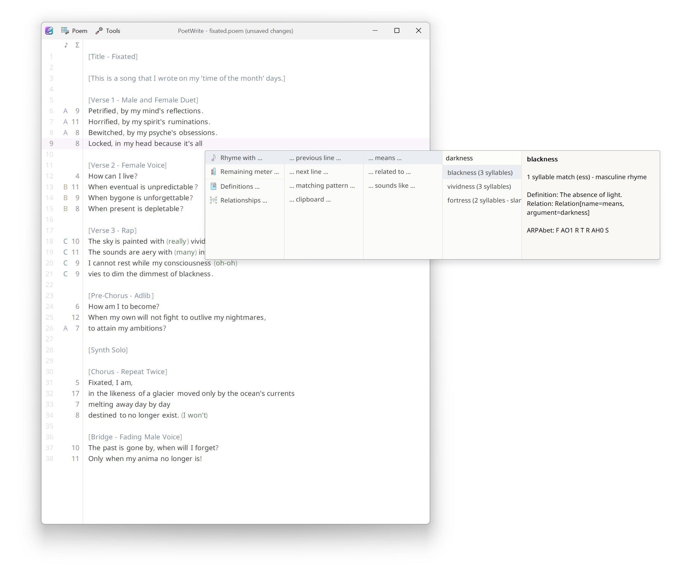
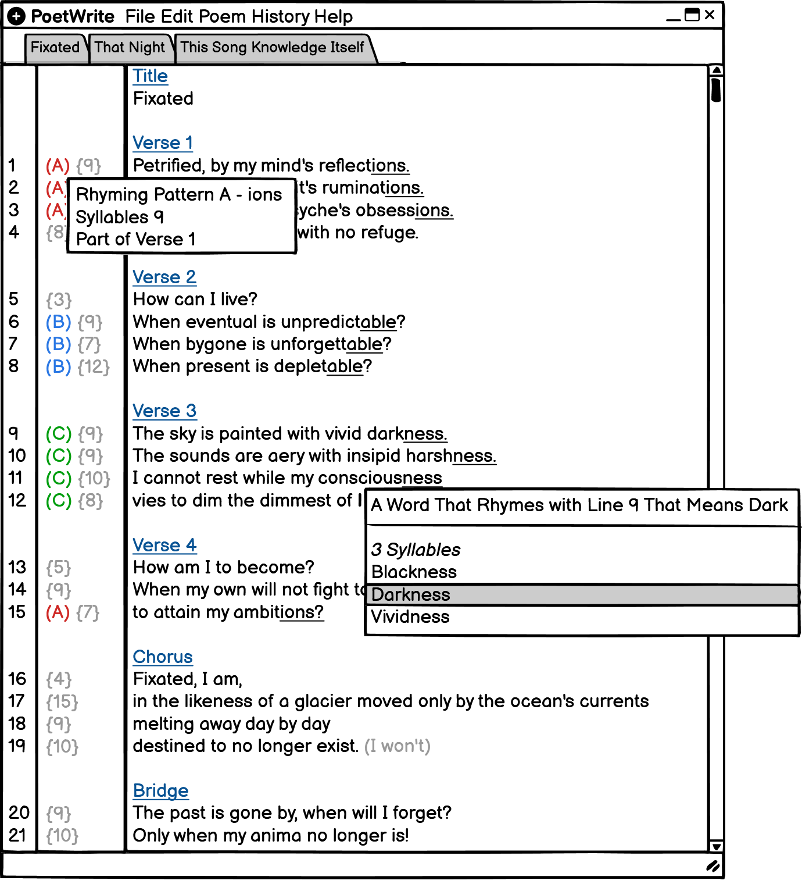

# Welcome to PoetWrite!

PoetWrite is an in-progress desktop application to bring an IDE-like experience for English poetry writers. 

At the heart of PoetWrite, is an advanced rhetorical and lexical analysis engine. Whether it's detecting rhyming patterns, measuring meter or calculating sentiment. While poets are known for possessing huge vocabularies, sometimes, you still need some help to find the right word for the next stanza. So PoetWrite will come with various lexicographic dictionaries that can find synonyms matching your pattern, word relationships, various conjugations and more.

I know artificial intelligence is the hot new trend, but, all the power of PoetWrite will be AI-free. That means that all the analyses and assistance are blistering fast and completely offline. The majority of the algorithms are written from scratch with the help of cleverly designed heuristics, some publicly available dictionaries and databases.

And maybe another trend that irks me a bit. PoetWrite is not a web app of any kind. Not an SPA wrapped in an embedded browser. Something more old-school that actually runs and feels like it belongs on your desktop.

## Status
PoetWrite is still in an early stage of development with the beginnings of elementary analysis features. If you want to see what PoetWrite is already capable of, start with the included [unit tests](/src/test/java/net/cdahmedeh/poetwrite/test/).

The current focus is on architecture and design, which is nearing completion. I spent almost a year designing it. The result was very rewarding and totally worth it, as implementing features is easy as inheriting a few interfaces. What's already done is the MVVM UI architecture, the asynchronous TaskBus system, subscribe-publish event style communication, inspired by micro-kernels. What's left is gutter display for the basic analyses, word hover for definitions and parts of speech, and the auto-complete system. There's some documentation below showing off how these parts are designed.

## Documentation

[Poem Analysis Implementation and Cache Design](/docs/entity-architecture.md) - An extensive deep-dive into how PoetWrite handles, stores and caches rhetorical analyses and other features. With detailed overview of the actual 'fool-proof' architecture and implementation through code examples and diagrams.

[Custom MVVM-style UI Framework](/docs/ui-architecture.md) - PoetWrite throws away the traditional MVC pattern for a more modern custom MVVM framework that is completely asynchronous, uses a subscribe-notify event system, and decoupling entities from the model.

[Asynchronous Task Bus and Lazy-Loaded Services](/docs/async-design.md) - My obsession with making PoetWrite as responsive as possible had lead me to develop a semi-custom task bus system. It ensures that compute-intensive tasks stay out of the UI thread so it doesn't hang. The same system also handles lazy-loading of services by (ab)using the dependency resolution system in the Dagger framework.

[Poem Syntax and Domain Structure](/docs/poem-syntax-and-domain-structure.md) - PoetWrite's domain objects structure. And the poem syntax with annotation and commenting features.

[Rhetorical Analysis Basics](/docs/rhetoric-analysis-basics.md) - Introductory topics for basic rhetorical analysis features such as syllable counting and rhyme detection.

[PoetWrite .poem Native File Format](/docs/file-format.md) - A lengthy introduction to the highly sophisticated PoetWrite .poem native file format. Designed with universal encoding that works with various text editors and cross-platform cross-editor compatibility. Version control system friendly and lightweight handling for file syncing systems. 

## Development

PoetWrite is an open-source project under the [GPLv3 license](/LICENSE.md) with no pecuniary interests.

The design is UX first, meaning that the user-experience dictates the design and architecture of the application rather than the other way around. Throughout the development, you'll see [wireframes](/docs/ux-wireframes.md) being added into the repository. 

As a technical writer, I believe that good documentation is part of the development process. Feel free to explore the ever-growing collection in the [documentation](/docs/) folder.

## Very First Screenshots

As the first iteration of early PoetWrite is coming to life, we can finally see PoetWrite taking shape in the real world! Look at the next section (with the wireframes) below to get an idea on how it will evolve further.

[//]: # (![PoetWrite Initial Screenshot]&#40;./assets/initial-screenshot.png&#41;)

## Wireframe Prototype
This is how the PoetWrite idea was born.

You can note some planned functionality that will be present in PoetWrite. As featured below.

- In the gutter on the left, you can see the syllable count of each line or verse.
- In the gutter again, you can see colour-coded indications for the rhyming pattern detected in the poem.
- When hovering over an entry in the gutter, the user will see the part that rhymes within the pattern, the syllable count, the belonging of which verse and even the meter of the line or verse.
- When hovering over a word, a variety of information that is shown about the word, such as definitions, part-of-speech and detailed information about the rhyming.
- One of the core powerful features of PoetWrite will be the lexicographic assistance. In the example below, the user wants to look for a word that rhymes with the last word in the next line, that is synonymous with a certain term. The initial design was to rely on keyboard shortcuts, but they'd be too many to remember. So I've gone for a 'wizard' style auto-complete system. 

