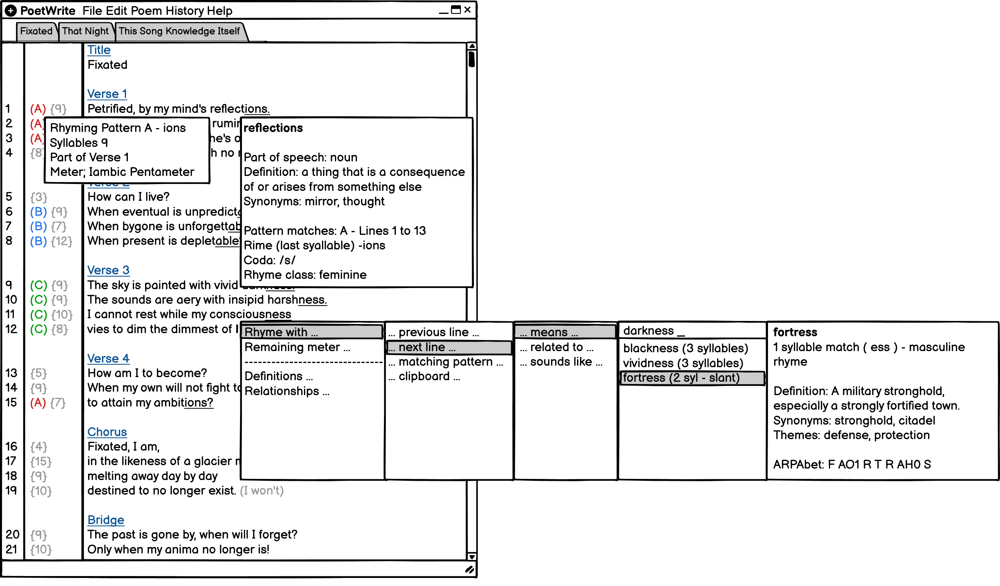

# Welcome to PoetWrite!

PoetWrite is an in-progress desktop application to bring an IDE-like experience for English poetry writers. 

At the heart of PoetWrite, is an advanced rhetorical and lexical analysis engine. Whether it's detecting rhyming patterns, measuring meters or calculating sentiment. While poets are known for posessing huge vocabularies, sometimes, you still need some help to find the right word for the next stanza. So PoetWrite will come with various lexicographic dictionaries that can find synonyms matching your pattern, word relationships, various conjugations and more.

I know artificial intelligence is the hot new trend, but, all the power of PoetWrite will be AI-free. That means that all the analyses and assistance are blistering fast and completely offline. The majority of the algorithms are written from scratch with the help of some publicly available dictionaries and databases.

## Status
PoetWrite is still in an early stage of development with the beginnings of elementary analysis features. If you want to see what PoetWrite is already capable of, start with the included [unit tests](/src/test/java/net/cdahmedeh/poetwrite/test/).

## Documentation

[Poem Syntax and Domain Structure](/docs/poem-syntax-and-domain-structure.md) - PoetWrite's domain objects structure. And the poem syntax with annotation and commenting features.

[Rhetorical Analysis Basics](/docs/rhetoric-analysis-basics.md) - Introductory topics for basic rhetorical analysis features such as syllable counting and rhyme detection.

## Development

PoetWrite is an open-source project under the [GPLv3 license](/LICENSE.md) with no pecuniary interests.

The design is UX first, meaning that the user-experience dictates the design and architecture of the application rather than the other way around. Throughout the development, you'll see [wireframes](/docs/ux-wireframes.md) being added into the repository. 

As a technical writer, I believe that good documentation is part of the development process. Feel free to explore the ever-growing collection in the [documentation](/docs/) folder.

## Wireframe Prototype
This is how the PoetWrite idea was born.

You can note some planned functionality that will be present in PoetWrite. As featured below.

- In the gutter on the left, you can see the syllable count of each line or verse.
- In the gutter again, you can see colour-coded indications for the rhyming pattern detected in the poem.
- When hovering over an entry in the gutter, the user will see the part that rhymes within the pattern, the syllable count, the belonging of which verse and even the meter of the line or verse.
- When hovering over a word, a variety of information that is shown about the word, such as definitions, part-of-speech and detailed information about the rhyming.
- One of the powerful features of PoetWrite will be the lexical assistance. In the example below, the user wants to look for a word that rhymes with the last word in the line, that is synonymous with a certain term. The initially design was to rely on keyboard shortcuts, but they'd too many. So I've gone for a 'wizard' style auto-complete system. 

