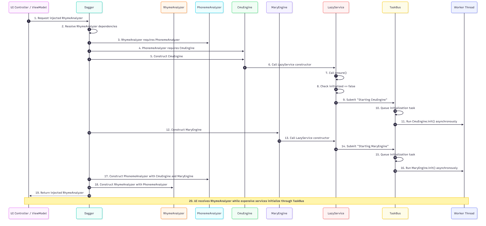

# Asynchronous Task Bus and Lazy-Loaded Services

PoetWrite's analysis and assistance features vary heavily in terms of how much computing they need. Something like syllable counting can be done very quickly. However, searching for a rhyming word is expensive. And keep in mind, that loading the massive thesaurus dictionary will also be quite heavy.

One of my most important user experience goals with PoetWrite is that the application remains responsive at all times. The interface shouldn't freeze every few seconds while the poem is being analyzed. So I put a lot of effort into designing a system that would handle this seamlessly.

Something else I really believe in is what I call 'foolproof implementation'. Extending an interface should be made in such a way that how to implement it is obvious. All the housekeeping should be done automatically, simply by using the existing abstractions.

## Services

Let's say we want to check if two words rhyme and how many syllables. PoetWrite already has ```RhymeAnalzyer``` which does this job.

```java
RhymeAnalysis analysis = rhymeAnalyzer.get(wordA, wordB);
int syllables = analysis.getNumberOfRhymeSyllables();
```

Now ```RhymeAnalyzer``` has several dependencies. Namely, it needs access to the syllable counter in ```PhonemeAnalyzer```. And then, in turn, it needs the CMU dictionary ```CmuEngine``` and text-to-speech system ```MaryEngine```.

Dependencies are tied together using the dependency injection pattern enabled by the Dagger library.

❗From herein, we will use the term **Service** to describe any dependency that PoetWrite requires for computation.

```java
@Singleton
public class RhymeAnalyzer extends FeatureAnalyzer<WordPair, RhymeAnalysis> {
    PhonemeAnalyzer phonemeAnalyzer;

    @Inject
    SyllableAnalyzer(PhonemeAnalyzer phonemeComputer) {
        this.phonemeComputer = phonemeComputer;
    }
}

@Singleton
public class PhonemeAnalyzer extends FeatureAnalyzer<Word, PhonemeAnalysis> {
    CmuEngine cmuEngine;
    MaryEngine maryEngine;

    @Inject
    PhonemeAnalyzer(CmuEngine cmuEngine, MaryEngine maryEngine) {
        this.cmuEngine = cmuEngine;
        this.maryEngine = maryEngine;
    }
}

@Singleton
public class CmuEngine extends LazyService {
    @Override
    protected void init() {
        // Very expensive dictionary loading...
        InputStream stream = ClassLoader.getSystemResourceAsStream(CMUDICT_FILE);
        List<String> entries = IOUtils.readLines(stream, Charset.defaultCharset());
    }
}

@Singleton
public class MaryEngine extends LazyService {
    @Override
    protected void init() {
        // Very expensive TTS engine loading...
        mary = new LocalMaryInterface();
    }
}
```

‼️Note the ```@Singleton``` annotation. Dagger will sometimes load multiple instances of the same service. This is to ensure that all services have only a unique instance. Preventing the accidental occurrence of duplicate versions of the same service to be loaded.

## Introducing ```TaskBus```

Like I said before, I want to avoid any operation from freezing the interface. For any reason. Whether it’s the lengthy initialization or an expensive computation.

Therefore, all tasks will be delegated to a separate thread, that is outside of the parts that handle the UI.

```TaskBus``` is essentially the scheduler for running tasks like initialization and computations externally, for example, outside of the UI.

It's essentially a wrapper around a ```ExecutorService``` thread-pool with some quality-of-life convenience features. Such as providing statuses that could be displayed in the main interface as a progress bar.

```java
@Singleton
public class TaskBus {
    private final ExecutorService pool = Executors.newSingleThreadExecutor();

    public void submit(String name, AppEvent event, Runnable run) {
        AppTask task = new AppTask(name, event, run);

        queue(task);

        Runnable runnable = () -> {
            try {
                set(task);
                run.run();
            } finally {
                publish(task);
                progress(task);
            }
        };

        Future<?> future = this.pool.submit(runnable);
    }

    // Returns an observable reactive class that the UI
    // can use to monitor the status of the running tasks
    // and display a progress bar.
    public Observable<TaskBusStatus> monitor() {
        return monitor;
    }
}
```

When tasks are complete, they throw an ```AppEvent``` which is basically a notification that can be used by the UI layer to know when a computation is complete and get its result. AppEvent contains no special features of any kind. Extended classes contain the results in any way that is appropriate for the computation.

```java
public abstract class AppEvent {}

public class TextUpdateEvent extends AppEvent {
    private String text = "";

    public TextUpdateEvent() {
    }

    public void setText(String text) {
        this.text = text;
    }

    public String getText() {
        return text;
    }
}
```

For convenience, all tasks are wrapped with ```AppTask```. It just contains a friendly name for the task, that is to be displayed in the UI, the corresponding event and the executable code itself.

```java
@RequiredArgsConstructor
public class AppTask {
    @Getter private final String name;
    @Getter private final AppEvent event;
    @Getter private final Runnable task;
}
```

To run a task within the ```TaskBus```, it can be invoked directly by injecting the bus itself, and then calling the ```submit``` method. This example right here just generates some random `lorem ipsum` text.

```java
TextUpdateEvent event = new TextUpdateEvent();

taskBus.submit("Generating Random Text " + new Random().nextDouble(), event, () -> {
    String text = textGenerator.generate();
    event.setText(text);
});
```

## Lazy-Loaded Services

With the implementation above, only the invocation of the services is done asynchronously on the ```TaskBus```. I mentioned earlier that I wanted the initialization to be done asynchronously too. 

So why not use the ```TaskBus``` to do that? Maybe something like this?

```java
taskBus.submit(String.format("Starting %s ",name()), new ServiceStartingEvent(), () -> {
    init();
    initialized = true;
});
```

Now, we can create a wrapper around all of this. A global interface that could provide access to the ```TaskBus``` and do the initialization asynchronously. 

```java
public abstract class LazyService {
    private volatile boolean initialized = false;

    protected final TaskBus taskBus;

    protected LazyService(TaskBus taskBus) {
        this.taskBus = taskBus;
        ensure();
    }

    public abstract String name();

    public void ensure() {
        if (initialized) return;

        taskBus.submit(String.format("Starting %s ",name()), new ServiceStartingEvent(), () -> {
            init();
            initialized = true;
        });
    };

    protected abstract void init();
}
```

```LazyService``` is an abstract class that automatically sends the initialization to the ```TaskBus``` as soon as the class is created.

Like I said earlier, I wanted an implementation that made things obvious. So to create a service to be lazy-loaded, you just extend it, and simply put the initialization code by implementing the ```init()``` method.

```java
public class MaryEngine extends LazyService {
    @Override
    protected void init() {
        mary = new LocalMaryInterface();
    }
```

## Dependency Injection as a dependency initialization mechanism

🕶️ I'll admit that this is quite a **dark pattern**, since it's not explicit at all. Kind of __sneaky__.

When a dependency is injected, say into a UI Controller, Dagger will automatically resolve all the dependencies backwards, starting with the 'deepest' dependencies and then going upwards until the base dependency is loaded.

Notice how ``ensure()`` and then ``init()`` are called directly in the constructor. Unlike say Spring Boot, Dagger uses a compile-time method. So when a dependency is invoked, the class is instantiated right away.

## Flow Visualization

Let's return to the original example we started, where we try to load ```RhymeAnalyzer```. You can see what is actually happening.

```
public class ExampleViewController extends ViewController<ExampleViewModel> {
    private final RhymeAnalyzer rhymeAnalyzer;

    @AssistedInject
    public MainViewController(@Assisted MainViewModel viewModel, TaskBus taskBus, RhymeAnalyzer rhymeAnalyzer) {
        super(viewModel, taskBus);
        this.rhymeAnalyzer = rhymeAnalyzer;
    }
}
```

## Step-by-Step Flow

1. The UI controller requests an injected `RhymeAnalyzer`.
2. Dagger begins resolving the constructor dependencies required by `RhymeAnalyzer`.
3. `RhymeAnalyzer` depends on `PhonemeAnalyzer`, so Dagger starts constructing `PhonemeAnalyzer` first.
4. `PhonemeAnalyzer` depends on `CmuEngine` and `MaryEngine`, so Dagger resolves those deeper dependencies before completing `PhonemeAnalyzer`.
5. Dagger constructs `CmuEngine`.
6. Because `CmuEngine` extends `LazyService`, its parent constructor is called.
7. The `LazyService` constructor calls `ensure()`.
8. `ensure()` sees that `CmuEngine` has not been initialized yet.
9. `ensure()` submits a `"Starting CmuEngine"` initialization task to the `TaskBus`.
10. The `TaskBus` queues the task and schedules it on in the thread pool.
11. The thread eventually runs `CmuEngine.init()`, loading the CMU dictionary outside the UI thread.
12. Dagger constructs `MaryEngine`.
13. Because `MaryEngine` also extends `LazyService`, the same lazy-loading process happens again.
14. `MaryEngine.ensure()` submits a `"Starting MaryEngine"` task to the `TaskBus`.
15. The `TaskBus` queues the task and schedules it on in the thread pool.
16. The thread eventually runs `MaryEngine.init()`, loading the MaryTTS engine outside the UI thread.
17. With `CmuEngine` and `MaryEngine` constructed, Dagger can now construct `PhonemeAnalyzer`.
18. With `PhonemeAnalyzer` constructed, Dagger can now construct `RhymeAnalyzer`.
19. The original requesting class receives the injected `RhymeAnalyzer`.
20. At this point, the application has access to `RhymeAnalyzer`, while the expensive initialization work for `CmuEngine` and `MaryEngine` is handled asynchronously by the `TaskBus`.

## Flow Sequence Diagram



## Design Problems

‼️The magic dependency-based initialization mechanism is really obtuse, and, honestly, a mystery if it wasn't documented. While it is pretty practical, it's impossible to have any control over it.

‼️Right now, everything is done in a single-threaded pool, so only one task at a time. However, something like parsing the poem should be done frequently. But if a dictionary is being loaded in he background, suddenly the parsing will stop for a long time. 

⛅Considering the above, it means that we might need some more sophisticated dependency hierarchy mechanism. Though I'm leaving this as an exercise for much later. I don't want to re-implement something akin to an init system like upstart or systemd. Could you imagine the nightmare?