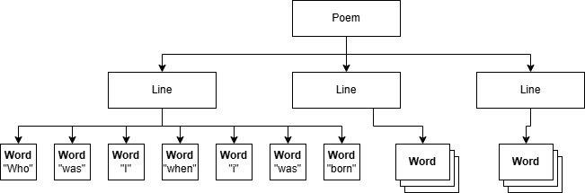
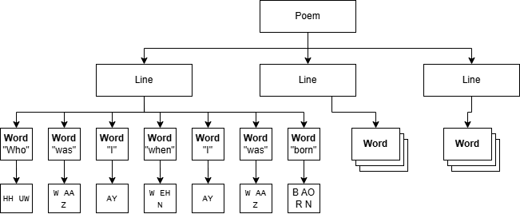
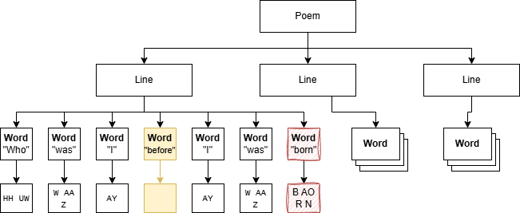
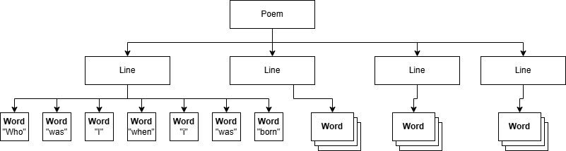
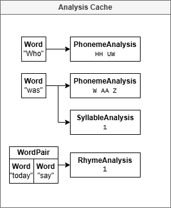
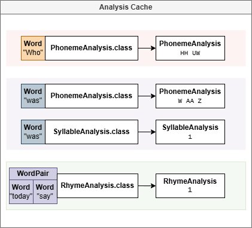
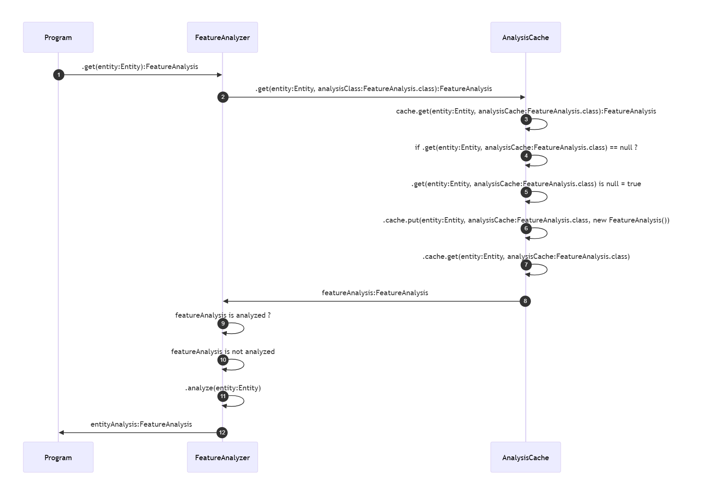

# Poem Analysis Implementation and Cache Design

The various analyses in PoetWrite are computationally expensive. And due to the incremental nature of writing, the actual text changes slowly. Therefore, it will be wasteful to analyze the entire poem on every single change. To save computational resources and improve application responsiveness, we can take advantage of caching for many of the oft-repeated analyses.

The various components of the poems are hereby called, ```Entity``` which includes parts like ```Poem```, ```Line``` and ```Word```. When parsing a Poem, the ```PoemExtendedVisitor``` parses the text and converts into an object hierarchy representing the ```Entity``` themselves and the relationship between them. For example a ```Poem``` has multiple ```Line``` or ```Line``` has multiple ```Word```.

When we are talking about analyses, let’s take a look at some very basic ones. Such as the syllable count of a word or the phonemes it contains.

# Solution A _(dropped)_: Text-Mapped ```Entity``` Domain Objects

My initial design, which was heavily influenced from my object-oriented paradigm brain-washing of Java, was to put them directly in the ```Entity``` objects. However, the challenge becomes immediate. How do we keep track of the ```Poem``` structure upon text changes? Remember, we want the computation to be cached. 

For this kind of design, the idea ends up having some 'smart' parsing that would maintain the relationship between the text and the object structure. And then try to determine which analyses to invalidate. I'd like an approach like this, and we might get some performance advantage, but the implementation complexity doesn't justify these potential small gains.

As a thought exercise, let’s look at what it could be in the real world.

**1. Parsing the Poem**

Let's start with a poem.

```
Who was I when I was born.
A light from past life.
Lives into the present of today.
```

And then parse into to generate an ```Entity``` structure. We're already doing this in ```PoemExtendedParser``` using our [```Poem.g4```](../src/main/antlr/net/cdahmedeh/poetwrite/parser/Poem.g4) grammar.



**2. Analyzing the Poem**

Now, let's do some very simple analysis. Say pulling out the phonemes of the word.



**3. Making an Edit**

Now, we're going to make a few edits. This is where the challenge becomes a bit more obvious.

```
Who was I  when  I was born.
           ||||       ||||
          CHANGE     DELETE
          ||||||      ||||
Who was I before I was     .
```

If you were doing this on paper, changing the structure is trivial. Change ```when``` to ```before```, invalidate the phoneme calculation and delete ```born```.



**4. Mapping the Entity to the Text and Tracking Changes**

So, my thought was to parse both the old and new text into tokens, our own object structure. Now, somehow, compare both the texts AND tokens (our object structure) and somehow come up with a 'diff'. For text that is trivial, but what about the tokens and the associated object structure. Now you need an entire system for listing the differences between object structure. And on top of all that, you'd need some kind of identifier for every single element, both the object and somehow in the text. And on top of that, invalidate the analysis. Also, don't forget, you need to actually keep track of where the tokens actually are in the text.

Here's a very rough pseudo-code of what the operation could look like. Keep in mind, these are only the operations, no variable or object structure here.

```python
parsed_old = parse(text_old)
parsed_new = parse(text_new)

diff = diff_sequences(parsed_old.text, parsed_new.text)

for change in diff:
    if change.type == DELETE:
        for i from change.old_start to change.old_end:
            token_id = tokens_old[i].id
            poem = poem_graph.find_by_token_id(token_id)
            poem_graph.invalidate(object)
            poem_graph.delete(object)
```

So what ends up happening is a ton of work anyways with some major drawbacks.

|What you thought you'd save|What actually happens|
|---|---|
|Only need to parse through the text once.|Requires parsing old and new text anyways. Two passes.
|Having the structure of the object structure modified piecemeal.|Requires the design of a 'diff' system for graph changes. 
|Analyses already saved for unchanged pieces|Still need to do a recursive analysis and do the invalidation based on the 'diff' system.
|Having analyses precomputed and cached can be complicated to determine when and what to invalidate.

As a result, the imagined benefits results in an implementation that is at best over-engineered and at worst overly complicated and fragile.


# Solution B *(current implementation)*: Seperate ``Entity`` and ```FeatureAnalysis``` objects.

## Goals

So we need to revisit my goals when I was developing PoetWrite. It's easy to make premature optimizations, so I started with a set of features that I wanted my system to have.

1. Repeated analyses should be saved or cached to prevent redundant computation and improve performance.
2. No need for complicated comparison of 'diff' structures or implementations.
3. Parsing passes should be quick and lightweight. This affords some leniency if multiple parsing passes are necessary. This also implies that the domain objects need to be minimal too.
4. Allows for computations to be done as a separate step for future optimizations such as asynchronous analyses and possibly multi-threading.
5. Implenting additional analyses or modifying them shouldn't require major design changes.
6. Should feel 'handsfree' in the sense that implementation of a new analysis should be minimal and things like cache handling and computations are part of the design. Rather than relying on a developer to maintain the assumptions and follow implicit patterns.

## Assumptions

## Analysis Cache

Let's start with a basic poem.

```
Who was I when I was born.
A light from past life.
Lives into the present of today.
I really don't know anymore what to say.
```

### Step 1 - Parsing the Poem

We're going to do a parsing pass like we did with the previous design. We get a neat tree with the ```Entity``` objects.



In this case, we're making a different assumption, that the parsing step is inexpensive and takes very little time. No computations are involved, so it should in theory be very lightweight. 

⛅ Some very crude benchmarking using the ANTLR parser showed some promising results. There will eventually be micro-benchmarks in the unit tests to measure the performance more precisely.

In the program, the syntax itself is defined as an [ANTLR4 grammar](../src/main/antlr/net/cdahmedeh/poetwrite/parser/Poem.g4). You can see the details over here about the [Domain and Syntax]((../docs/poem-syntax-and-domain-structure.md)) structure. Parsing isn't very complicated once the grammar is setup and the code generated.

```java
public static Poem fromText(String text) {
    PoemLexer lexer = new PoemLexer(CharStreams.fromString(text));
    CommonTokenStream stream = new CommonTokenStream(lexer);
    PoemParser parser = new PoemParser(stream);

    PoemParser.PoemContext context = parser.poem();
    PoemVisitor visitor = new PoemExtendedVisitor();

    return (Poem) visitor.visit(context);
}
```

As you can, parsing thanks to ANTLR is actually quite simple.

### Step 2 - Analysis Cache

Before I show how the cache is actually built, we'll work backwards. This is what I suggest the cache to look like after we've done some computations. This is essentially my vision.



As you can see, individual analyses are stored, already computed, in the cache. When an analysis needs to be computed, it will be done externally by an external process and then stored into the cache.

The actual structure of the cache is a map, where getting the analyses simply requires passing the entity itself as a key. And as a result, you will get the various analyses for that entity.

In terms of actual storage, there are some data-structures that are useful. If you notice, you can see how one entity can have more than one analysis in it. Of course, a conventional Map won't allow us to do that. So, something like a [MultiMap](https://guava.dev/releases/19.0/api/docs/com/google/common/collect/Multimap.html), where one key can have multiple values is one option. Or a [Table](https://guava.dev/releases/19.0/api/docs/com/google/common/collect/Table.html), where the rows are the entities and columns the classes for the feature analysis.

Of course, it was immediately obvious that we'd have some major limitations. Because I'm foreseeing that this cache might get pretty large and complex, I'm already thinking of using something like [Caffeine](https://github.com/ben-manes/caffeine). And like many other libraries of the same sort, they only use a conventional map. This is because I'm expecting to need to control over a sophisticated caching strategy.

So, instead, we do things the other way around. Rather than trying to force a key to contain multiple values. We have a set of features assigned to a single key.

The key contains the entity itself, as well as the class that represents the type of feature analysis. And this is the key that we use for our map.

So this is what the key looks like.
```java
public class AnalysisKey<E extends Entity, A extends FeatureAnalysis> {
    private final E entity;

    private final Class<A> type;
}
```

And that map, which as you can, is a conventional map. No Multimap, no Tables.
```java
private Map<AnalysisKey, FeatureAnalysis> cache = new ConcurrentHashMap<>();
```

So, now to retrieve an entry from the map, this is all we need to do. Let's say we want to get the computed phonemes.

```java
Word word = new Word("anymore");
FeatureAnalysis analysis = cache.get(word, PhonemeAnalysis.class);
```

There, at the end, this is what our cache really looks like. Compare it to the image above with what I've initially suggested.



❓ Parts for the same word have been highlighted for clarity. It's just the *'effective'* result. The cache is not actually aware of one entity having multiple values. 

⛔ In fact, there's no way simple way to see how many feature analyses a word has. And I can foresee some cases where we might need to do that. For example, when the analyses of an ```Entity```, like a ```Word```, needs to be invalidated for another analysis if some feature of the poem changes.


### Step 3 - Analysis Sequence and Analyzer Design

If we return to our goals above, I mentioned that

"Should feel 'handsfree' in the sense that implementation of a new analysis should be minimal and things like cache handling and computations are part of the design. Rather than relying on a developer to maintain the assumptions and follow implicit patterns."

So before I explain, I thought it might be more reasonable to start directly with the design.

For a start, this is all I want to do in code, the abstractions should be good enough that things like cache handling is done behind the scenes. Without needing to do any 'paperwork'.

```java
Word endothalmicWord = new Word("endothalmic");
SyllableAnalysis endothalmicAnalysis = syllableAnalyzer.get(endothalmicWord);
int numberOfSyllables = endothalmicAnalysis.getNumberOfSyllables());
```

Behind the scenes, this is what is actually happening.

First, there's a ```FeatureAnalyzer``` that actually does the computations needed for the feature. For example, ```SyllableAnalyzer``` computes how many syllables in a word. As we mentioned in the [Basic Rhetorical Analysis](../docs/rhetoric-analysis-basics.md), the phonemes are pulled and then the vowels are counted.

```java
Word endothalmicWord = new Word("endothalmic");
SyllableAnalysis endothalmicAnalysis = syllableAnalyzer.get(endothalmicWord);
```

Within the analyzer, the computation starts.

```java
public class PhonemeAnalyzer extends FeatureAnalyzer<Word, PhonemeAnalysis> {
    //...

    /* package */ void analyze(Word word, SyllableAnalysis analysis) {
        List<Phoneme> phonemes = phonemeEngine.getPhonemes();

        int syllables = (int) phonemes.stream()
                .filter(Phoneme::isVowel)
                .count();

        SyllableAnalysis syllableAnalysis = new SyllableAnalysis(word);
        analysis.setNumberOfSyllables(syllables);
    }

    //...
```

Notice how there no's explicit cache access, not even a return value. This is because the caching is handled automagically.

That's because it extends ```FeatureAnalyzer```, which itself actually contains a reference to the cache. It's the one that actually invokes it.

```java
public abstract class FeatureAnalyzer<E extends Entity, A extends FeatureAnalysis> {
    AnalysisCache analysisCache;

    FeatureAnalyzer(AnalysisCache analysisCache) {
        this.analysisCache = analysisCache;
    }

    public A get(E entity, Class<A> analysisClass) {
        A analysis = analysisCache.get(entity, analysisClass);

        if (analysis.analyzed() == false) {
            analyze(entity, analysis);
        }

        return analysis;
    }

    /* package */ abstract void analyze(E entity, A analysis);
}
```

So all the ```FeatureAnalyzer``` needs to do, is fill in the computation for the analysis in the ```analyze(..)``` method.

Now, we can take a look at the cache itself. Remember, we had a goal here:

Repeated analyses should be saved or cached to prevent redundant computation and improve performance.

```java
@Singleton
public class AnalysisCache {

    @Inject
    public AnalysisCache() {}

    private Map<AnalysisKey, FeatureAnalysis> cache = new ConcurrentHashMap<>();

    @SneakyThrows
    public <E extends Entity, A extends FeatureAnalysis> A get(E entity, Class<A> analysisClass) {
        AnalysisKey<E, A> key = AnalysisKey.of(entity, analysisClass);
        FeatureAnalysis analysis = cache.get(key);

        if (analysis == null) {
            analysis = analysisClass
                    .getConstructor(entity.getClass())
                    .newInstance(entity);
            cache.put(key, analysis);
        }

        return analysisClass.cast(analysis);
    }
}
```

Keeping that in mind, knowing the structure, this is what this code does, in order.

I. Try and get the analysis from the cache. ```FeatureAnalysis analysis = cache.get(AnalysisKey.of(entity, analysisClass));``` 

II. Does the cache have the analysis already? ```analysis == null```

a.  It does. Therefore, no work to do, just pass it on.

b.  It doesn't. So let's create a new one for that entity and type, compute it, and then put it in the cache. Then pass it on.

```java
// Java does generic type erasure. So this is like
// analysis = new A(entity)
analysis = analysisClass
        .getConstructor(entity.getClass())
        .newInstance(entity);
cache.put(key, analysis);
```

This is what the sequence ends up looking life.



### Step 4 - Implementation

So you can see there are quite a few moving parts, but here's the big advantage:

To develop an analysis, all you need to do is extend FeatureAnalyzer and implement the analysis. Nothing else.

```java
public abstract class FeatureAnalyzer<E extends Entity, A extends FeatureAnalysis> {
    // ---

    /* package */ abstract void analyze(E entity, A analysis);

    // ---
}
```

```java
public class SyllableAnalyzer extends FeatureAnalyzer<Word, SyllableAnalysis> {
    // ---

    @Override
    /* package */ void analyze(Word word, PhonemeAnalysis analysis) {
        // TODO 1 : Do your analysis magic here.
        Feature feature = computer.getFeatures();

        // TODO 2 : Fill in the analysis.
        analysis.setFeature(feature);
    }

    // ---
}
```

And that's it!

### Step 5 - What's Next?

So there are a few things I haven't tackled yet, but they are going to be very relevant in the future.

⛅ First, the analysis should NOT be automatic like they are right now. We are forcing it to happen as soon as the cache is invoked. For now, with only unit tests with no time measurements, it's serviceable. And the computations are not expensive, yet.

⛅ I have not taken into account what a typical poem writing flow is like. This means, I don't really have a cache behaviour strategy. Normally, writing is incremental, and there ends up being a lot of repeated analysis because many words stay the same.

⛅ It is not multi-thread-friendly. In something like a text editor, just like IDEs, calculations and code checking are done outside of the UI, in another thread. And with a clever debounding system that only does it after a certian time has elapse from the previous check, or when the user has stopped typing for a few seconds.

⛅ There's no hierarchy of importance for analyses. Something like syllable counting is pretty cheap, and can done repeatedly over and over again. But what about pattern detection or dictionary searches? Those are heavy to infer, we want to do those less often.

⛅ Not prepared for features that are on-demand. Something like syllable counting, rhyme detection and pattern detection are being done all the time. But determining something like part-of-speech, or a definition, only shows when you hover a certain word. How can we prevent those on-demand features from being determined until it is time for the user to need it?

⛅ Invalidation is going to be a bit tricky, and we can't rely on any heuristics to do that. There needs to be an explicit system that handles this basic on what the user is doing, what is likely to change and so on. At least for now, I can't think in terms of heuristics, it will be by hand.

⛅ Taking into account the point above, we need a solid strategy for invalidation. Right now, the ```FeatureAnalysis``` don't hold an actual state. The fields are just cleared and we do some ```null`` checks.