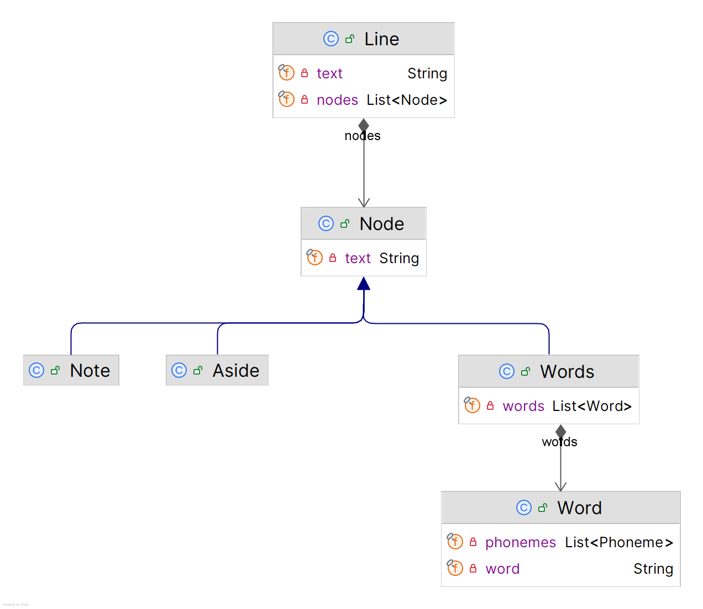
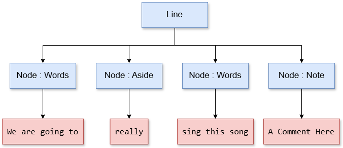

# Backstory

Last year, I discovered [Suno](https://suno.com), generative-AI for music. I found it a bit of fun writing lyrics and having it do the rest. So the syntax for was immediately a source of inspiration for me. It allows you to put comments within the lyrics to specify how the stanza will be read — such as adlib or female voice. And the other features are having asides that could be lyrics that are read in the background or another voice instead.

# Syntax

Because PoetWrite is supposed to be accessible, I kept the syntax as simple as possible. And to allow some flexibility when it comes to the rhetorical analysis.

There are just three features:

**Text** — Anything that is just plain text is considered part of the poem.

**Aside** — Text that is surrounded by parentheses ```(``` and ```)``` will be ignored by the analysis. For example, that word (or words) will not be counted as syllables in the counting or ignored in the rhyming pattern calculation.

**Note** — Anything with brackets ```[``` and ```]``` won't be considered part of the text at all and ignored by PoetWrite completely. These can be used for commenting on the poem.

⛅ Stanzas will likely be based on separated empty lines similar to how Markdown handles paragraphs.

# Example

```
We are going to (really) sing this song. [A Comment Here]
                ^^^^^^^^                 ^^^^^^^^^^^^^^^^
                 aside                         note
```

# Domain Objects and Structure

The scheme above is translated into a set of entities that will be mostly used for PoetWrite's computations. 

These are the preliminary entities.
<p align="center"></p>

A **Poem** represents the entire corpus of the text seperate by lines of text. Each line starts with a **Line** which has a set of **Nodes**. Those can be either a **Note** or **Aside** or **Words**. These neatly map to the syntax features mentioned earlier.

**Words** include the entire text in the part that it represents, and go down further with a list of **Word** entities.

⁉️ The **Words** entites contains a list of **Word** which hold an individual word and the phonemes calculated from the various methods described elsewhere. It is not relevant to the discussion here. 

⛅ My plan was to initially put the results of the analyses into this structure which would be powerful for optimization, but a nightmare to manage as text changes. I went for a cached analysis paradigm which are cached outside of this structure.

Using the example above, this is the outcome.



# Parsing

I'm currently just using [_ANTLR_](https://www.antlr.org/) to do the parsing with a simple grammar in the [Poem.g4](/src/main/antlr/net/cdahmedeh/poetwrite/parser/Poem.g4) markup.

📩 [RSyntaxTextArea](https://github.com/bobbylight/RSyntaxTextArea) is what I'm planning to use for syntax-highlighting. It has its own token system that I will have to write specifically for.

📩 Graceful error handling will be a crucial feature, especially in something dynamic where editing text is done in real time and need graceful degradation.

# Complete Preview

```
[Title - Fixated]

[This is a song that I wrote on my 'time of the month' days.]

[Verse 1 - Male and Female Duet]
Petrified, by my mind's reflections. 
Horrified, by my spirit's ruminations. 
Bewitched, by my psyche's obsessions. 
Locked, in my head with no refuge.

[Verse 2 - Female Voice]
How can I live? 
When eventual is unpredictable? 
When bygone is unforgettable? 
When present is depletable?

[Verse 3 - Rap]
The sky is painted with (really) vivid darkness. 
The sounds are aery with (many) insipid harshness. 
I cannot rest while my consciousness  (oh-oh)
vies to dim the dimmest of blackness.

[Pre-Chorus - Adlib]
How am I to become? 
When my own will not fight to outlive my nightmares, 
to attain my ambitions?

[Synth Solo]

[Chorus - Repeat Twice]
Fixated, I am, 
in the likeness of a glacier moved only by the ocean's currents
melting away day by day
destined to no longer exist. (I won't)

[Bridge - Fading Male Voice]
The past is gone by, when will I forget? 
Only when my anima no longer is!
```

