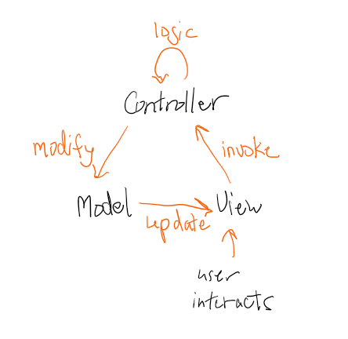
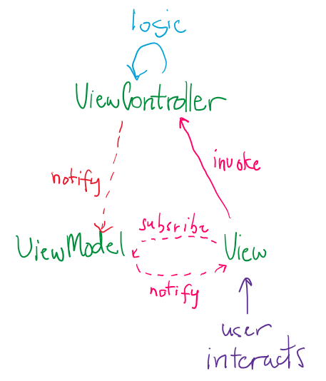
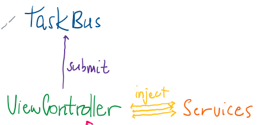
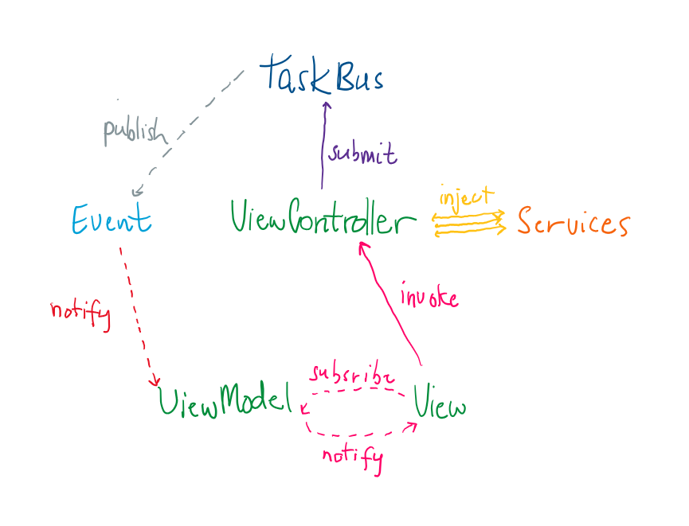

# Custom MVVM-style UI Framework

# Background

Writing desktop apps have always been a mess. While there's probably less desktop UI frameworks than JavaScript, there's a still a ton. While all web frameworks boil down to rendering HTML/CSS/JS, the questions for desktop frameworks are very different. Cross-platform? Emulation? Native? Hi-DPI support? Font-hinting?

Having written so many Swing desktop apps in my career, unfortunately, it seemed like an easy choice. Not because I prefer it, but because I wanted to focus on the linguistic features of PoetWrite without wrestling something that I'm not fluent in. I'll leave that exploration when I make the right-of-passage todo-list app.

The good news is, Swing is still in-development. Most of JetBrains' IDEs use some customized version of it, it has support for HiDPI, and you can make it look decent with something like FlatLaf. And it's multi-platform, though I bet it looks terrible on Linux.

# Goals

Like I often mentioned, I really want PoetWrite to feel responsive, despite the expensive compute it needs for much of the analyses and assistance features.

Part of this problem was already solved with the ```TaskBus``` system that I've discussed in the [Asynchronous Task Bus and Lazy-Loaded Services](/docs/async-design.md) document. We'll be taking advantage of its design to solve the responsiveness problem.

As I've mentioned countless times, I want PoetWrite to have 'foolproof implementation'. Extending an interface should be made in such a way that how to implement it is obvious. All the housekeeping should be done automatically, simply by using the existing abstractions. However, I'll admit that for this part, I failed to do that.

# The problem with Model-View-Controller

MVC was a very common paradigm for desktop applications a decade ago. The separation seemed intuitive. But reality sank in when you actually started to write your application using it.

## Traditional MVC Flow

In the traditional MVC paradigm, the View, Model and Controller are tied to each other directly.



At first glance, it makes sense, it seems clean. 

1. The user interacts with the view.
2. the view calls the controller to handle some logic.
3. The logic changes some data.
4. The update data is modified in the model.
5. The model updates the view.

But this is where the elephant in the room shows up. Any of these operations can be blocking. Complex logic will hang the controller, and the view has to wait for the controller to update the model and have the model update the view.

The other major limitation is that the view has to rely on the model for the updates. But some operations could be bidirectional.

So imagine if you have a text\-field like an email field. You want to type and make changes to enter the email address. Now, you have to wait for the whole cycle to be completed so that the email address gets updated. But with traditional MVC, the model can't reflect the changes directly from the view.

## Model vs ViewModel

The first flaw is the Model, which is supposed to literally be your domain object, the same one used by your database, the same one for serialization, the same one for saving to the disk. 

But the reality is, your UI is often not a perfect one-to-one representation of your domain object. For example, let’s say you want to display a user's age from a patient database. In the domain object, and the database too, you'd likely be storing the date of birth as a Unix-timestamp. However, since you'd like the UI to display the age, you need to do some math, but storing that in the domain object suddenly introduces the risk for inconsistency.

Instead, you can keep the domain object, and have an independent ViewModel which contains the age representation. Now the responsibility is offset to the UI-layer. The domain object can now be kept clean.

## Controller vs ViewController

The controller is commonly understood to be where the business logic would be, or at least invoke something in the backend to do that processing. However, in my experience, I noticed that developers had trouble deciding where the business logic belonged. And of course, you end up with something that's a bit tangled, and if poorly documented, you'd probably wouldn't even know where the logic actually was.

Instead, I suggest, what I'm calling a ViewController. The idea is that every single business logic operation would be forced to an external service.

To make this simple, we can use dependency injection straight into the ViewController. And this means, it actually doesn't matter where the service lies, whether it's in the application, an external server, or something far away in the cloud.

The ViewController takes advantage of the TaskBus to ensure that tasks are run outside of the UI thread.

## View

At this point, the view gets quite cleaned up. Because now, it only has two responsibilities.

First, the obvious one, create the display for the UI.

Second, invoke the ViewController to do some kind of action.

# Suggested Flow



This is my alternative to the traditional MVC framework. I already explained what ViewModel and ViewController are, but this becomes a detail at thie point.

Let's take a look at my suggested flow.

1. The ``View`` subscribes to the ``ViewModel``
2. The user interacts with the ``View``
3. The ``View`` invokes the ViewController to do some logic.
4. After the ``ViewController`` does its job, it notifies the ``ViewModel``
5. The ``ViewModel`` is updated.
6. The ``ViewModel`` notifies the View
7. The ``View`` updates the display.

Notice how there's no direct coupling between any of the components? Now, the View doesn't have to wait for the ``ViewController`` to update the ``ViewModel``. With the subscribe-notify scheme, any changes to the model can be gracefully accepted by the view. And on top of that, it's bidirectional.

# Asynchronous Controller Invocation with ```TaskBus```

However, we still haven't solved one problem, the ``View`` invoking the ViewController can still cause the ``View`` to hang.

The solution, run the logic on a separate thread! Without the coupling in the traditional MVC scheme, the ViewModel can be updated by the ``ViewController`` at its leisure!

We're going to take advantage of the ```TaskBus``` discussed in [Asynchronous Task Bus and Lazy-Loaded Services](/docs/async-design.md) to do that.



## Service Injection

The ``ViewController`` is the one responsible for running the business logic. But much of the logic is too complex, and repeated throughout between multiple ``ViewController`` controller instances.

Therefore, services are just injected straight into the controller.

## Combining TaskBus with the UI

Now that we have access to the TaskBus and injected services, we can actually decouple the ``ViewController`` and ``ViewModel`` completely.



The TaskBus now becomes responsible for handling the notification mechanism. The ``ViewModel`` is now waiting for an event from the TaskBus instead.

‼️ This provides a big advantage. Now, tasks can update multiple View components at the same time. So this prevents the tangling issues that tend to happen with traditional MVC, where different pieces have to reference each other.

# Implementation Example

Time to put all the pieces together. We're going to create a very simple UI scenario. Where the user can generate random 'lorem ipsum' text and have it displayed in a text field.

We'll keep it simple.

### ViewController

Starting with the ``ViewController``, you can just inject the service that you need, and have a function call to use the service to do your task. Note how the logic is submitted to the TaskBus rather than being done in the ``ViewController``.

```java
public class ExampleViewController extends ViewController<ExampleViewModel> {
    private final TextGenerator textGenerator;

    @AssistedInject
    protected ExampleViewController(@Assisted MenuViewModel viewModel, TaskBus taskBus, TextGenerator textGenerator) {
        super(viewModel, taskBus);
        this.textGenerator = textGenerator;
    }

    @AssistedFactory
    public interface ExampleViewControllerFactory {
        ExampleViewController create(ExampleViewModel ExampleViewModel);
    }

    public void generateRandomText() {
        for (int i = 0; i < 10; i++) {
            TextUpdateEvent event = new TextUpdateEvent();
            taskBus.submit("Generating Random Text " + new Random().nextDouble(), event, () -> {
                String text = textGenerator.generate();
                event.setText(text);
        });
    }
}
```

### ViewModel

Then with the ``ViewModel``, this is where all the content is stored. In this case, the string that serves as the value that will eventually be displayed in the view.

For each field, you create a ``BehaviorSubject``. It's basically an observer entity that can be subscribed to. So if something changes, it notifies whoever listens to it. In our case, the ``View`` will subscribe to it to monitor changes.

In addition, the model is the one that listens for the event, and updates the observable subject.

```java
public class ExampleViewModel extends ViewModel {
    private BehaviorSubject<String> text = BehaviorSubject.createDefault("");

    @AssistedInject
    public ExampleViewModel(TaskBus taskBus) {
        super(taskBus);
    }

    @AssistedFactory
    public interface ExampleViewModelFactory {
        ExampleViewModel create();
    }

    @Override
    protected void listen(AppTask task, AppEvent event) {
        if (event instanceof TextUpdateEvent textUpdateEvent) {
            String text = textUpdateEvent.getText();
            this.text.onNext(text);
        }
    }

    public Observable<String> streamText() {
        return this.text.hide();
    }
}

public class TextUpdateEvent extends AppEvent {
    private String text = "";

    public TextUpdateEvent() {
    }

    public void setText(String text) {
        this.text = text;
    }

    public String getText() {
        return text;
    }
}
```

### View

The ``View`` of course does the layout and rendering of the UI. We just have a text field with a "Generate Random Text" button below it. When the user clicks on it, it will invoke the controller.

Notice how the ``View`` does not interact directly with the model. Instead, it just subscribes to the observable in the model.

```java
public class ExampleView extends View<ExampleViewModel, ExampleViewController, JFrame> {
    private RSyntaxTextArea textArea;
    private JButton generateRandomTextButton;

    public ExampleView(ExampleViewModel viewModel, ExampleViewController viewController) {
        super(viewModel, viewController);
    }

    @Override
    protected void setup() {
        frame = new JFrame("PoetWrite");
        frame.setDefaultCloseOperation(JFrame.DO_NOTHING_ON_CLOSE);
        frame.setSize(1280, 800);

        textArea = new RSyntaxTextArea(20, 60);
        RTextScrollPane sp = new RTextScrollPane(textArea);
        frame.add(sp, BorderLayout.CENTER);

        generateRandomTextButton = new JButton("Generate Random Text");
    }

    @Override 
    void listen() {
        generateRandomTextButton.addActionListener(e -> {
            viewController.generateRandomText();
        });
    }

    @Override
    protected void subscribe(CompositeDisposable disposable) {
        Disposable textSubscriber = viewModel.streamText()
                .subscribe(text -> {
                    SwingUtilities.invokeLater(() -> textArea.setText(text));
                });

        disposable.add(textSubscriber);
    }
}
```

# Challenges

‼️One of the biggest issues with MVC-style framework is that you have a tendency to put things in places where they don't belong. For example, some model value in the view, or accidentally including business logic in the model. As the sole developer, I'd like think I have enough discipline to do that. But I failed often.

‼️While this solution is quite elegant, it is also very complicated. To this day, despite having done a ton of desktop and web applications in my career, I still struggle to make things readable enough for someone else. I wrote this document much after designing my framework, and I struggled a bit because I'd forget how some components worked.

⛅The PoetWrite project has shown how difficult it is to make clean and maintainable large-scale applications. Especially when multiple developers are involved. And especially in the age of agile-development, where things like requirements and specifications become afterthoughts, it becomes a challenge when refactoring comes into play. PoetWrite has been an occasional project for me, and the contenxt-switching is quite jarring.