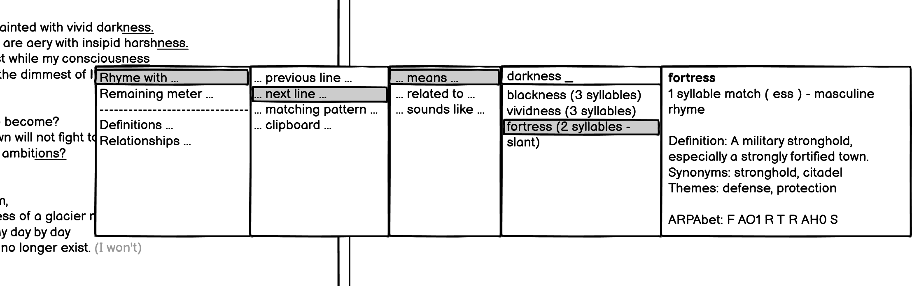
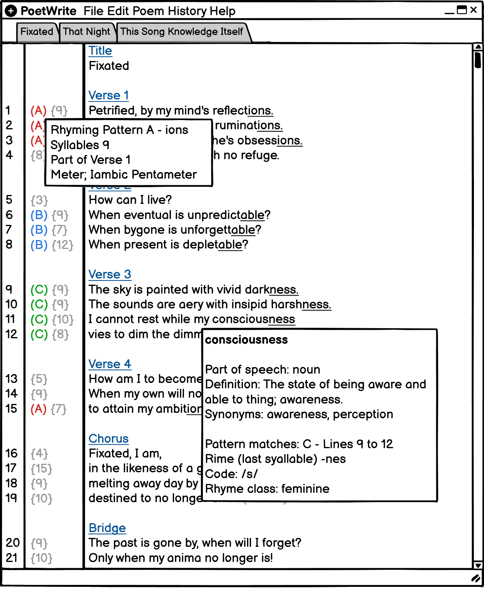

# UX Prototypes and Wireframes

Just a few wireframes that show my plans for the UI for Poetwrite.

## Main Screen

This is the main screen for PoetWrite. The central part is the text editor which allows you to type in your poem. On the left, the gutter, will show line numbers, pattern and number of syllables.

A minimasltic interface that doesn't get in the way, with tabs for editing multiple poems at a time. 

## Assistance

PoetWrite will come with a very comprehensive set of assitance features. In this one, the user is looking for a word that rhymes with the last line that means 'darkness'.

Once the word they want is highlighted, they will see detailed statistics about the word.

The goal here was to minimize the amount of keyboard shortcuts. All the user needs to know is that the auto-complete key (probably Ctrl+Space) will bring in a step-by-step wizard.

## Hover Information

If the user puts their cursor over a word, they will get various statistics about. Hovering over the cutter will bring pertinent statistics about the line as well.

